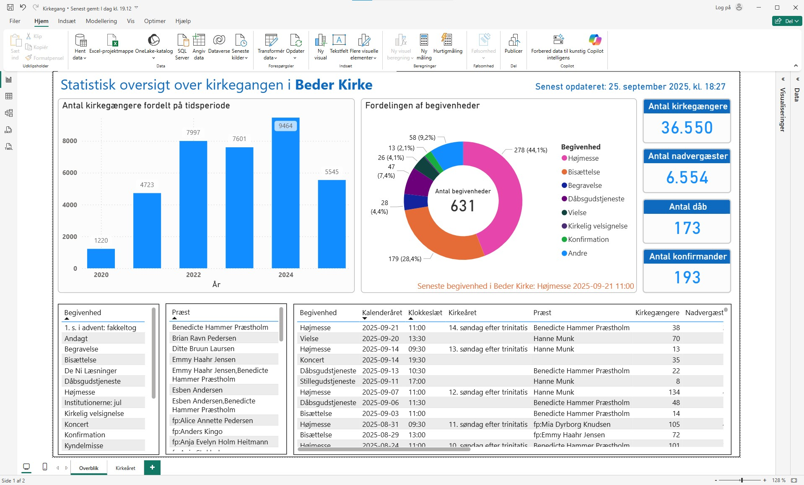

<h3>Microsoft Power BI</h3>

<b>Author:</b> Brian Ravn Pedersen, Data Engineer and Software Developer 
<b>Created:</b> 2025-09-26 
<b>Languages used:</b> DAX, PHP, SQL 
<b>GitHub Repository:</b> https://github.com/brp-labs/power-bi 

<h3>Data-Driven Decision Making with Microsoft Power BI</h3>

<b>REST API</b> 
API til udtræk af dynamiske data fra en cloud-hostet MySQL/MariaDB-database, designet til integration med Power BI Desktop via Power Query.
API'et er kodet i PHP og filen findes i rodmappen under navnen pbiapi.php.
 

<b>Interaktiv Power BI-rapport</b> 
Herunder et screenshot af den interaktive Power BI-rapport (på desktop), der i tabeller og grafik giver et overblik over de aktuelle statistiske data vedrørende kirkegangen i Beder Kirke. Der kan filtreres på talrige måder med de forskellige visualiseringer i rapporten.
  

